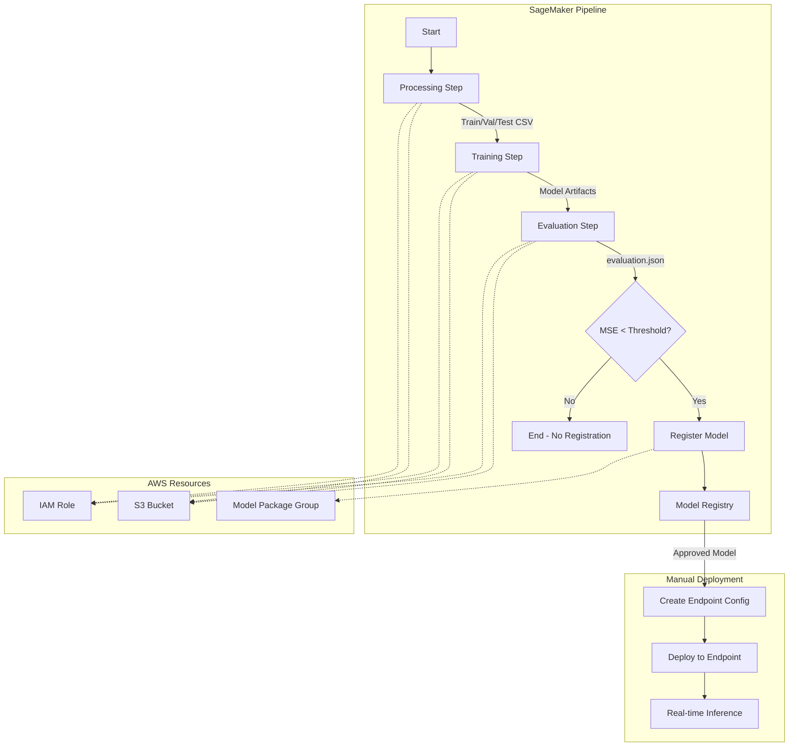

# SageMaker MLOps Pipeline Starter

[](https://github.com/saranreddy/sagemaker-mlops-pipeline-starter/actions/workflows/ci.yml)
[](https://opensource.org/licenses/MIT)
[](https://www.python.org/downloads/)

A production-ready AWS SageMaker MLOps pipeline starter for end-to-end machine learning workflows. This repository provides a complete, working example of a SageMaker Pipelines flow: data processing → training → evaluation → conditional model registration → deployment to a real-time endpoint.

Built with best practices for clarity, maintainability, and professional MLOps engineering.

## Features

- **Complete SageMaker Pipeline** with data processing, training (XGBoost), evaluation, conditional registration, and deployment
- **Infrastructure as Code** with Terraform for repeatable AWS resource provisioning (IAM roles, S3, Model Registry)
- **Real-world dataset** using California Housing for regression (small, fast, cheap)
- **Conditional deployment** based on model performance metrics
- **Professional structure** with clear separation of concerns, configuration management, and CLI entrypoints
- **CI/CD ready** with GitHub Actions for linting, testing, and validation
- **Cost-conscious** with cleanup guidance and small instance types

## Architecture



## Prerequisites

- **AWS Account** with appropriate permissions (or admin access for initial setup)
- **AWS CLI** configured with credentials (`aws configure`)
- **Python 3.10+** installed
- **Terraform 1.0+** (for infrastructure provisioning)
- **Git** for cloning this repository

## Quick Start

### 1. Clone and Install

```bash
git clone https://github.com/saranreddy/sagemaker-mlops-pipeline-starter.git
cd sagemaker-mlops-pipeline-starter

# Create and activate virtual environment
python -m venv venv
source venv/bin/activate  # On Windows: venv\Scripts\activate

# Install dependencies
pip install -r requirements.txt
```

### 2. Provision AWS Infrastructure

```bash
cd infra

# Initialize Terraform
terraform init

# Review planned changes
terraform plan

# Apply infrastructure (creates IAM role, S3 bucket, Model Registry)
terraform apply

# Save outputs for configuration
terraform output
```

**Note the outputs**: You'll need `sagemaker_role_arn` and `s3_bucket_name` for the next step.

### 3. Configure Pipeline

```bash
cd ..
cp config/config.example.yaml config/config.yaml

# Edit config/config.yaml with your values from Terraform outputs:
# - aws_region: your AWS region (e.g., us-east-1)
# - sagemaker_role_arn: from terraform output sagemaker_role_arn
# - s3_bucket: from terraform output s3_bucket_name
```

### 4. Create and Run Pipeline

```bash
# Create or update the pipeline definition in SageMaker
python scripts/upsert_pipeline.py

# Start a pipeline execution
python scripts/start_pipeline.py
```

**Monitor progress**: Go to AWS Console → SageMaker → Pipelines → `california-housing-pipeline`

### 5. Deploy Model (After Pipeline Completes)

```bash
# Deploy the latest model to a real-time endpoint
# Note: You may need to manually approve the model in Model Registry first
python scripts/deploy_model.py
```

The deployment script will:
1. Find the latest approved (or pending approval) model package
2. Create a SageMaker model
3. Create an endpoint configuration
4. Create or update a real-time inference endpoint

## Project Structure

```
.
├── config/
│   └── config.example.yaml          # Configuration template
├── infra/                           # Terraform infrastructure
│   ├── main.tf                      # Provider configuration
│   ├── variables.tf                 # Input variables
│   ├── s3.tf                        # S3 bucket for artifacts
│   ├── iam.tf                       # SageMaker execution role
│   ├── sagemaker.tf                 # Model Package Group
│   ├── outputs.tf                   # Output values
│   └── terraform.tfvars.example     # Variable values template
├── scripts/                         # CLI entrypoints
│   ├── upsert_pipeline.py          # Create/update pipeline
│   ├── start_pipeline.py           # Start pipeline execution
│   └── deploy_model.py             # Deploy model to endpoint
├── src/
│   ├── pipeline/                    # Pipeline definition
│   │   ├── __init__.py
│   │   ├── pipeline.py             # SageMaker Pipeline orchestration
│   │   └── config.py               # Configuration utilities
│   └── scripts/                     # Processing/training scripts
│       ├── preprocessing.py         # Data preparation
│       ├── train.py                # XGBoost training
│       └── evaluate.py             # Model evaluation
├── tests/                          # Unit tests
│   ├── conftest.py
│   ├── test_config.py
│   └── test_pipeline.py
├── .github/
│   └── workflows/
│       └── ci.yml                  # GitHub Actions CI
├── .gitignore
├── LICENSE
├── README.md
└── requirements.txt
```

## Pipeline Steps Explained

### 1. **Processing Step** (`PreprocessData`)
- Loads California Housing dataset from sklearn
- Splits into train (64%), validation (16%), test (20%)
- Saves CSV files to S3 for downstream steps

### 2. **Training Step** (`TrainModel`)
- Trains XGBoost regression model on housing data
- Uses train and validation sets
- Hyperparameters: max_depth=5, eta=0.1, num_round=100
- Saves model artifacts to S3

### 3. **Evaluation Step** (`EvaluateModel`)
- Loads trained model and test dataset
- Computes MSE, RMSE, MAE, R² metrics
- Writes `evaluation.json` with results

### 4. **Condition Step** (`CheckMseThreshold`)
- Reads MSE from evaluation.json
- If MSE ≤ threshold (default 0.5): proceed to registration
- If MSE > threshold: skip registration (model not good enough)

### 5. **Model Registration Step** (`RegisterModel`)
- Registers model in SageMaker Model Registry
- Creates model package with metadata and metrics
- Status: `PendingManualApproval` (approve in Console before deployment)

### 6. **Deployment** (Manual via script)
- Run `scripts/deploy_model.py` after approving model
- Creates endpoint configuration
- Deploys to real-time inference endpoint
- Endpoint name: `california-housing-endpoint` (configurable)

## Configuration Options

Edit `config/config.yaml` to customize:

| Parameter | Description | Default |
|-----------|-------------|---------|
| `aws_region` | AWS region for resources | `us-east-1` |
| `sagemaker_role_arn` | IAM role ARN for SageMaker | Required (from Terraform) |
| `s3_bucket` | S3 bucket for artifacts | Required (from Terraform) |
| `pipeline_name` | Pipeline name | `california-housing-pipeline` |
| `model_package_group_name` | Model Registry group | `california-housing-models` |
| `instance_type` | Training instance type | `ml.m5.xlarge` |
| `instance_count` | Number of training instances | `1` |
| `mse_threshold` | MSE threshold for registration | `0.5` |
| `endpoint_instance_type` | Endpoint instance type | `ml.t2.medium` |

## Cost Considerations

Running this pipeline incurs AWS costs. Typical costs per execution (us-east-1):

- **Processing**: ml.m5.xlarge ~$0.02 (1-2 minutes)
- **Training**: ml.m5.xlarge ~$0.05 (5 minutes with California Housing)
- **Evaluation**: ml.m5.xlarge ~$0.01 (1 minute)
- **Endpoint**: ml.t2.medium ~$0.06/hour (while running)
- **S3 storage**: Negligible for this dataset

**Total per run**: ~$0.10 (plus endpoint costs if deployed)

### Cost Management

1. **Delete endpoint when not in use**:
   ```bash
   aws sagemaker delete-endpoint --endpoint-name california-housing-endpoint --region us-east-1
   ```

2. **Stop pipeline executions** if unwanted runs start

3. **Clean up old model artifacts** from S3:
   ```bash
   aws s3 rm s3://YOUR-BUCKET/california-housing-pipeline/ --recursive
   ```

4. **Destroy infrastructure** when done:
   ```bash
   cd infra
   terraform destroy
   ```

## Development

### Running Tests Locally

```bash
# Install dev dependencies
pip install pytest flake8 black isort

# Run tests
pytest tests/ -v

# Format code
black src/ scripts/ tests/
isort src/ scripts/ tests/

# Lint
flake8 src/ scripts/ tests/ --max-line-length=120
```

### Validating Terraform

```bash
cd infra
terraform fmt -check
terraform validate
```

## Troubleshooting

### Common Issues

1. **"Role ARN contains 123456789012"**
   - You need to run `terraform apply` first and update `config/config.yaml` with real values

2. **"No model packages found"**
   - Pipeline hasn't completed yet, or model didn't pass threshold
   - Check SageMaker Console → Pipelines for execution status

3. **"Access Denied" errors**
   - Ensure your AWS credentials have sufficient permissions
   - Check that the Terraform-created IAM role has necessary policies

4. **Pipeline step failures**
   - Check CloudWatch Logs: `/aws/sagemaker/ProcessingJobs`, `/aws/sagemaker/TrainingJobs`
   - Verify S3 bucket exists and role has access

5. **Import errors when running scripts**
   - Ensure you're in the repository root directory
   - Activate virtual environment: `source venv/bin/activate`

## Customization Guide

### Using a Different Dataset

1. Modify `src/scripts/preprocessing.py` to load your dataset
2. Update `src/scripts/train.py` for your ML task (classification/regression)
3. Adjust `src/scripts/evaluate.py` metrics accordingly
4. Update threshold in `config/config.yaml`

### Changing the ML Framework

Replace XGBoost with sklearn, TensorFlow, PyTorch, etc.:

1. Update `framework_version` in config
2. Modify `src/scripts/train.py` with your framework's API
3. Update `src/pipeline/pipeline.py` to use appropriate SageMaker estimator
4. Adjust `requirements.txt` with framework dependencies

### Adding Hyperparameter Tuning

Extend `src/pipeline/pipeline.py`:

1. Import `HyperparameterTuner` from SageMaker SDK
2. Replace `TrainingStep` with tuning job
3. Update condition to use best model from tuning

## Contributing

Contributions welcome! This is a starter template meant to be forked and customized.

If you find issues or have improvements:
1. Fork the repository
2. Create a feature branch
3. Submit a pull request

## License

MIT License - see [LICENSE](LICENSE) file for details.

## Acknowledgments

- Built with [AWS SageMaker](https://aws.amazon.com/sagemaker/)
- Uses [California Housing Dataset](https://scikit-learn.org/stable/modules/generated/sklearn.datasets.fetch_california_housing.html)
- Infrastructure automation with [Terraform](https://www.terraform.io/)

---

**Author**: [Saran Alla](https://github.com/saranreddy)

**Project**: Professional MLOps pipeline starter for AWS SageMaker

**Questions?** Open an issue or check the [troubleshooting section](#troubleshooting) above.
