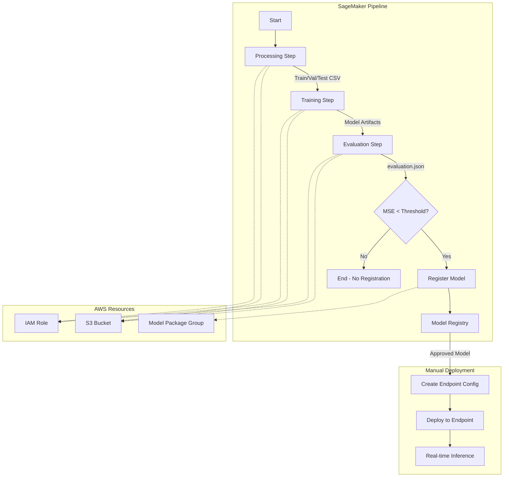

# SageMaker MLOps Pipeline Starter

[](https://github.com/saranreddy/sagemaker-mlops-pipeline-starter/actions/workflows/ci.yml)
[](https://opensource.org/licenses/MIT)
[](https://www.python.org/downloads/)

A production-ready AWS SageMaker MLOps pipeline starter for end-to-end machine learning workflows. This repository provides a complete, working example of a SageMaker Pipelines flow: data processing → training → evaluation → conditional model registration → deployment to a real-time endpoint.

Built with best practices for clarity, maintainability, and professional MLOps engineering.

## Who This Is For

This starter is for teams moving from notebooks to repeatable, auditable ML pipelines on AWS.

**Good fit when you need:**
- Scheduled retraining on tabular data with lineage tracking
- Manual approval gates before model deployment (common in regulated industries)
- A reference architecture for standardizing ML projects across your organization
- Model Registry integration with automated promotion workflows
- Terraform-managed infrastructure for reproducible AWS setups

**Common in these contexts:**
- Fintech, insurance, and e-commerce teams on AWS with compliance or audit requirements
- Platform/MLOps engineers setting up a team's first production pipeline on SageMaker
- ML engineers or data scientists graduating from notebooks to automated retraining

**Not a good fit for:**
- One-off experiments or exploratory analysis (a notebook is simpler and faster)
- Teams standardized on other platforms (Databricks, Vertex AI, Kubeflow)
- LLM or GenAI serving workloads (consider [Amazon Bedrock](https://aws.amazon.com/bedrock/) or SageMaker JumpStart instead)
- Real-time feature stores or streaming training (this starter uses batch processing)

**After deployment**: Model monitoring is a separate concern. See the companion [saranreddy/sagemaker-model-monitor-starter](https://github.com/saranreddy/sagemaker-model-monitor-starter) for tracking drift, data quality, and performance degradation in production.

## Features

- **Complete SageMaker Pipeline** with data processing, training (XGBoost), evaluation, conditional registration, and deployment
- **Infrastructure as Code** with Terraform for repeatable AWS resource provisioning (IAM roles, S3, Model Registry)
- **Real-world dataset** using California Housing for regression (small, fast, cheap)
- **Conditional deployment** based on model performance metrics
- **Professional structure** with clear separation of concerns, configuration management, and CLI entrypoints
- **CI/CD ready** with GitHub Actions for linting, testing, and validation
- **Cost-conscious** with cleanup guidance and small instance types

## Architecture



## Prerequisites

- **AWS Account** with IAM permissions to create roles, S3 buckets, and SageMaker resources
- **AWS CLI** installed and configured with your credentials (`aws configure`)
- **Python 3.10+** installed locally
- **Terraform 1.0+** installed locally
- **Git** for cloning this repository

## Run Against Your AWS Account

### Step 0: Verify Your Setup

Your AWS CLI credentials will be used to run Terraform and create a separate SageMaker execution role. Ensure:

```bash
# Check AWS CLI is configured
aws sts get-caller-identity

# Verify your default region (must match terraform and config.yaml)
aws configure get region
```

**CRITICAL**: Note your AWS region. You must use the same region in:
1. AWS CLI default region (`aws configure get region`)
2. Terraform variables (`infra/terraform.tfvars` or CLI default)
3. Pipeline configuration (`config/config.yaml`)

Region mismatch is the most common setup failure.

### Step 1: Clone and Set Up Python Environment

```bash
git clone https://github.com/saranreddy/sagemaker-mlops-pipeline-starter.git
cd sagemaker-mlops-pipeline-starter

# Create and activate virtual environment
python -m venv venv
source venv/bin/activate  # On Windows: venv\Scripts\activate

# Install dependencies
pip install -r requirements.txt
```

### Step 2: Provision AWS Infrastructure with Terraform

```bash
cd infra

# Initialize Terraform
terraform init

# (Optional) Customize region or names
cp terraform.tfvars.example terraform.tfvars
# Edit terraform.tfvars if you want non-default values

# Review planned resources
terraform plan

# Create resources (type 'yes' when prompted)
terraform apply
```

Terraform creates:
- S3 bucket (with versioning and encryption)
- IAM execution role for SageMaker (least-privilege permissions)
- Model Package Group for Model Registry

**Save the outputs**:

```bash
terraform output
```

Copy the displayed `sagemaker_role_arn` and `s3_bucket_name` for the next step.

### Step 3: Configure the Pipeline

```bash
cd ..
cp config/config.example.yaml config/config.yaml
```

Edit `config/config.yaml` with values from Terraform:

```yaml
aws_region: us-east-1  # MUST match your AWS CLI region
sagemaker_role_arn: arn:aws:iam::YOUR_ACCOUNT_ID:role/sagemaker-mlops-execution-role
s3_bucket: sagemaker-mlops-artifacts-YOUR_ACCOUNT_ID
```

**Do not** leave placeholder values like `123456789012`. The scripts validate and will reject them.

### Step 4: Create the Pipeline Definition

```bash
# Upsert (create or update) the pipeline in SageMaker
python scripts/upsert_pipeline.py
```

This defines the pipeline in SageMaker but does not execute it.

### Step 5: Start a Pipeline Execution

```bash
# Start the pipeline
python scripts/start_pipeline.py
```

The script will print an execution ARN and ID. Monitor progress in the AWS Console:

1. Navigate to **SageMaker → Pipelines** in the AWS Console
2. Select `california-housing-pipeline`
3. View the execution (typically takes 8-12 minutes)

Alternatively, use the AWS CLI:

```bash
aws sagemaker list-pipeline-executions \
  --pipeline-name california-housing-pipeline \
  --region us-east-1
```

### Step 6: Approve the Model (Required for Deployment)

After the pipeline completes successfully, the model will be in `PendingManualApproval` status. You must approve it:

1. Go to **SageMaker → Model Registry** in the AWS Console
2. Select `california-housing-models`
3. Click on the latest model version
4. Click **Update status** → **Approve**

### Step 7: Deploy the Model to an Endpoint

```bash
# Deploy the approved model to a real-time endpoint
python scripts/deploy_model.py
```

The script will:
1. Find the latest approved model package (falls back to `PendingManualApproval` if no approved model)
2. Create a SageMaker Model resource
3. Create an Endpoint Configuration
4. Create or update the `california-housing-endpoint`

Endpoint deployment takes 5-10 minutes. You can monitor:

```bash
aws sagemaker describe-endpoint \
  --endpoint-name california-housing-endpoint \
  --region us-east-1
```

### Step 8: (Optional) Test the Endpoint

```bash
# Example inference with AWS CLI
aws sagemaker-runtime invoke-endpoint \
  --endpoint-name california-housing-endpoint \
  --content-type text/csv \
  --body "8.3252,41.0,6.984126984126984,1.0238095238095237,322.0,2.5555555555555554,37.88,-122.23" \
  --region us-east-1 \
  output.json

cat output.json
```

### Step 9: Clean Up Resources

To avoid ongoing charges:

```bash
# 1. Delete the endpoint (most important - charges per hour)
aws sagemaker delete-endpoint --endpoint-name california-housing-endpoint --region us-east-1

# 2. Wait for endpoint deletion, then delete endpoint config
aws sagemaker delete-endpoint-config --endpoint-config-name <config-name> --region us-east-1

# 3. Delete the model
aws sagemaker delete-model --model-name <model-name> --region us-east-1

# 4. Destroy Terraform-managed resources
cd infra
terraform destroy  # Type 'yes' when prompted

# 5. (Optional) Delete old pipeline executions' artifacts from S3
aws s3 rm s3://YOUR-BUCKET/california-housing-pipeline/ --recursive --region us-east-1
```

**Note**: Endpoint charges (~$0.06/hour for `ml.t2.medium`) accrue while the endpoint exists. Always delete it when not in use.

## Project Structure

```
.
├── config/
│   └── config.example.yaml          # Configuration template
├── infra/                           # Terraform infrastructure
│   ├── main.tf                      # Provider configuration
│   ├── variables.tf                 # Input variables
│   ├── s3.tf                        # S3 bucket for artifacts
│   ├── iam.tf                       # SageMaker execution role
│   ├── sagemaker.tf                 # Model Package Group
│   ├── outputs.tf                   # Output values
│   └── terraform.tfvars.example     # Variable values template
├── scripts/                         # CLI entrypoints
│   ├── upsert_pipeline.py          # Create/update pipeline
│   ├── start_pipeline.py           # Start pipeline execution
│   └── deploy_model.py             # Deploy model to endpoint
├── src/
│   ├── pipeline/                    # Pipeline definition
│   │   ├── __init__.py
│   │   ├── pipeline.py             # SageMaker Pipeline orchestration
│   │   └── config.py               # Configuration utilities
│   └── scripts/                     # Processing/training scripts
│       ├── preprocessing.py         # Data preparation
│       ├── train.py                # XGBoost training
│       └── evaluate.py             # Model evaluation
├── tests/                          # Unit tests
│   ├── conftest.py
│   ├── test_config.py
│   └── test_pipeline.py
├── .github/
│   └── workflows/
│       └── ci.yml                  # GitHub Actions CI
├── .gitignore
├── LICENSE
├── README.md
└── requirements.txt
```

## Pipeline Steps Explained

### 1. **Processing Step** (`PreprocessData`)
- Loads California Housing dataset from sklearn
- Splits into train (64%), validation (16%), test (20%)
- Saves CSV files to S3 for downstream steps

### 2. **Training Step** (`TrainModel`)
- Trains XGBoost regression model on housing data
- Uses train and validation sets
- Hyperparameters: max_depth=5, eta=0.1, num_round=100
- Saves model artifacts to S3

### 3. **Evaluation Step** (`EvaluateModel`)
- Loads trained model and test dataset
- Computes MSE, RMSE, MAE, R² metrics
- Writes `evaluation.json` with results

### 4. **Condition Step** (`CheckMseThreshold`)
- Reads MSE from evaluation.json
- If MSE ≤ threshold (default 0.5): proceed to registration
- If MSE > threshold: skip registration (model not good enough)

### 5. **Model Registration Step** (`RegisterModel`)
- Registers model in SageMaker Model Registry
- Creates model package with metadata and metrics
- Status: `PendingManualApproval` (approve in Console before deployment)

### 6. **Deployment** (Manual via script)
- Run `scripts/deploy_model.py` after approving model
- Creates endpoint configuration
- Deploys to real-time inference endpoint
- Endpoint name: `california-housing-endpoint` (configurable)

## Configuration Options

Edit `config/config.yaml` to customize pipeline behavior:

| Parameter | Description | Source/Default |
|-----------|-------------|----------------|
| `aws_region` | AWS region (**must match AWS CLI and Terraform**) | Required (manual) |
| `sagemaker_role_arn` | IAM role ARN for SageMaker | Required (from `terraform output`) |
| `s3_bucket` | S3 bucket for artifacts | Required (from `terraform output`) |
| `pipeline_name` | Pipeline name in SageMaker | `california-housing-pipeline` |
| `model_package_group_name` | Model Registry group name | `california-housing-models` |
| `instance_type` | Training instance type | `ml.m5.xlarge` |
| `instance_count` | Number of training instances | `1` |
| `mse_threshold` | MSE threshold for model registration | `0.5` |
| `endpoint_name` | Endpoint name for deployment | `california-housing-endpoint` |
| `endpoint_instance_type` | Endpoint instance type | `ml.t2.medium` |
| `endpoint_instance_count` | Endpoint instance count | `1` |

**Note**: `framework_version` (`1.7-1`) refers to the XGBoost framework version used by SageMaker.

## Common Failure Modes

### 1. Missing or Invalid `config/config.yaml`

**Error**: `FileNotFoundError: Config file not found: config/config.yaml`

**Fix**: Copy the example config and populate with your Terraform outputs:

```bash
cp config/config.example.yaml config/config.yaml
# Edit config.yaml with values from: terraform output
```

### 2. Placeholder Values in Configuration

**Error**: `ValueError: Please update the SageMaker role ARN in config.yaml with your actual AWS account ID`

**Fix**: Replace `123456789012` with real values from `terraform output`. The scripts validate configs and reject placeholder account IDs.

### 3. Region Mismatch

**Error**: `ResourceNotFoundException` or `AccessDeniedException` when running scripts

**Fix**: Ensure the same region everywhere:

```bash
# Check AWS CLI default region
aws configure get region

# Check terraform region (infra/terraform.tfvars or infra/variables.tf default)
grep aws_region infra/terraform.tfvars

# Check config.yaml
grep aws_region config/config.yaml
```

All three must match.

### 4. Model Stuck in `PendingManualApproval`

**Error**: `deploy_model.py` finds a model but deployment later fails, or no approved models exist

**Fix**: Models registered by the pipeline require manual approval:

1. Go to **SageMaker → Model Registry** → `california-housing-models`
2. Click the model version
3. **Update status** → **Approve**

Then re-run `python scripts/deploy_model.py`.

### 5. Insufficient IAM Permissions for Terraform

**Error**: `AccessDenied` when running `terraform apply`

**Fix**: Your AWS CLI user/role needs permissions to create IAM roles, S3 buckets, and SageMaker resources. Grant `IAMFullAccess`, `AmazonS3FullAccess`, and `AmazonSageMakerFullAccess` (or admin for initial setup).

### 6. SageMaker Role Missing Permissions

**Error**: Pipeline steps fail with `AccessDenied` in CloudWatch logs

**Fix**: This should not happen with Terraform-created roles. If customizing IAM, ensure the SageMaker execution role has S3, ECR, CloudWatch, and SageMaker permissions (see `infra/iam.tf`).

## Cost Considerations

Running this pipeline incurs AWS costs. Typical costs per execution (us-east-1, California Housing dataset):

- **Processing**: ml.m5.xlarge ~$0.02 (1-2 minutes)
- **Training**: ml.m5.xlarge ~$0.05 (5 minutes)
- **Evaluation**: ml.m5.xlarge ~$0.01 (1 minute)
- **S3 storage**: <$0.01 for artifacts
- **Endpoint (if deployed)**: ml.t2.medium ~$0.06/hour while running

**Total per pipeline run**: ~$0.10 (one-time)  
**Total per month with endpoint**: ~$43.20 (if endpoint left running 24/7)

### Minimizing Costs

Endpoints are the primary ongoing cost. Delete them immediately when not needed:

```bash
aws sagemaker delete-endpoint --endpoint-name california-housing-endpoint --region us-east-1
```

Pipeline execution costs are one-time per run. The infrastructure resources (S3, IAM, Model Registry) have no hourly charges.

## Development

### Running Tests Locally

```bash
# Install dev dependencies
pip install pytest flake8 black isort

# Run tests
pytest tests/ -v

# Format code
black src/ scripts/ tests/
isort src/ scripts/ tests/

# Lint
flake8 src/ scripts/ tests/ --max-line-length=120
```

### Validating Terraform

```bash
cd infra
terraform fmt -check
terraform validate
```

## Troubleshooting

For detailed failure modes, see the [Common Failure Modes](#common-failure-modes) section above.

Additional debugging tips:

- **Pipeline step failures**: Check CloudWatch Logs at `/aws/sagemaker/ProcessingJobs` and `/aws/sagemaker/TrainingJobs`
- **Import errors**: Ensure you're in the repository root and the venv is activated (`source venv/bin/activate`)
- **Endpoint errors**: Check `aws sagemaker describe-endpoint --endpoint-name california-housing-endpoint --region us-east-1`
- **Terraform state conflicts**: If working with a team, consider using a remote backend (S3 + DynamoDB)

## Customization Guide

### Using a Different Dataset

1. Modify `src/scripts/preprocessing.py` to load your dataset
2. Update `src/scripts/train.py` for your ML task (classification/regression)
3. Adjust `src/scripts/evaluate.py` metrics accordingly
4. Update threshold in `config/config.yaml`

### Changing the ML Framework

Replace XGBoost with sklearn, TensorFlow, PyTorch, etc.:

1. Update `framework_version` in config
2. Modify `src/scripts/train.py` with your framework's API
3. Update `src/pipeline/pipeline.py` to use appropriate SageMaker estimator
4. Adjust `requirements.txt` with framework dependencies

### Adding Hyperparameter Tuning

Extend `src/pipeline/pipeline.py`:

1. Import `HyperparameterTuner` from SageMaker SDK
2. Replace `TrainingStep` with tuning job
3. Update condition to use best model from tuning

## Contributing

Contributions welcome! This is a starter template meant to be forked and customized.

If you find issues or have improvements:
1. Fork the repository
2. Create a feature branch
3. Submit a pull request

## License

MIT License - see [LICENSE](LICENSE) file for details.

## Acknowledgments

- Built with [AWS SageMaker](https://aws.amazon.com/sagemaker/)
- Uses [California Housing Dataset](https://scikit-learn.org/stable/modules/generated/sklearn.datasets.fetch_california_housing.html)
- Infrastructure automation with [Terraform](https://www.terraform.io/)

---

**Author**: [Saran Alla](https://github.com/saranreddy)

**Project**: Professional MLOps pipeline starter for AWS SageMaker

**Questions?** Open an issue or check the [troubleshooting section](#troubleshooting) above.
